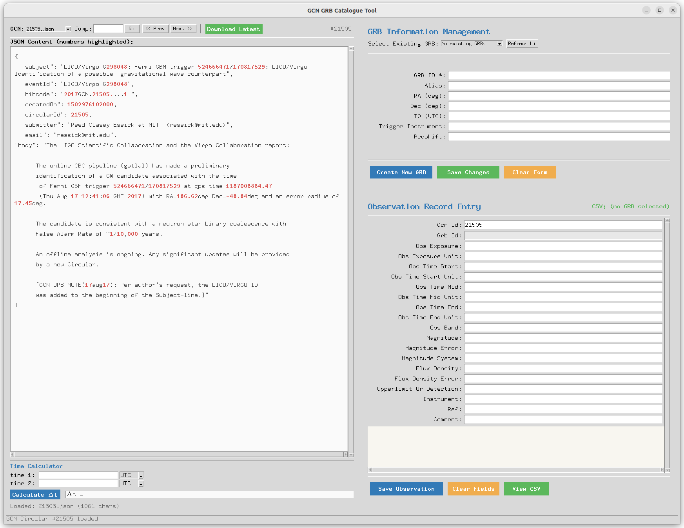

# GCN GRB Catalogue Tool

Interactive Python/tkinter tool for helping extract observation records from GCN Circular JSON files and saving them into structured data tables.

This toolkit was entirely generated through Vibe Coding using [Kimi](https://www.kimi.com).



## Directory Structure

```
GCN_GRB_catalogue/
├── gcn_catalogue_tool.py      # Main program
├── coltitle.txt               # Column titles for observation CSV
├── archive.json/              # GCN JSON files (auto-created on first download)
│   ├── 40685.json
│   ├── 40686.json
│   └── ...
└── Cata_output/               # Output directory (auto-created)
    ├── grb_info/              # GRB basic info JSON files
    │   ├── GRB250610B.json
    │   └── ...
    └── grb_lc/                # Light curve / observation CSV files
        ├── GRB250610B.csv
        └── ...
```

## Quick Start

```bash
python gcn_catalogue_tool.py
```

On first run, click **Download Latest** in the left panel to fetch the full GCN archive (~10,000+ JSON files). You can also manually place individual GCN JSON files into the `archive.json/` folder.

---

## Left Panel: GCN JSON Browser

### Controls

| Control | Description |
|---------|-------------|
| GCN dropdown | Select a JSON file from `archive.json/` (sorted numerically) |
| Jump input + Go | Jump directly to a specific GCN ID (e.g., `40689`) |
| `<< Prev` / `Next >>` | Navigate to previous/next file |
| `Download Latest` | Download & extract the latest GCN archive from NASA GCN |

### Keyboard Shortcuts

| Key | Action |
|-----|--------|
| `Ctrl+Left` / `Ctrl+P` | Previous file |
| `Ctrl+Right` / `Ctrl+N` | Next file |

### JSON Display

- **Numbers highlighted in red bold** (integers, decimals, scientific notation)
- **Automatic word wrap** - long lines (especially `body` field) wrap to window width
- **Escaped `\n` expanded** - text inside JSON string values displays as real line breaks with indentation
- JSON keys and boolean/null values have syntax coloring

### Time Calculator (bottom of left panel)

A small tool for computing time differences between two timestamps.

| Input | Format | Example |
|-------|--------|---------|
| time 1 / time 2 | UTC | `2025-06-10T12:34:56.789` or `2025-06-10 12:34:56` |
| time 1 / time 2 | MJD | `60838.523573` |

Click **Calculate Δt** (or press Enter) to display the difference in seconds, minutes, hours, and days simultaneously. Result text is selectable for copy.

---

## Top-Right Panel: GRB Info Management

### Fields

| Field | Required | Description |
|-------|----------|-------------|
| GRB ID | Yes | Format: `GRBYYYMMDD` or `GRBYYYMMDDA` (no spaces) |
| Alias | No | Alternative name for the GRB |
| RA | No | Right Ascension in degrees |
| Dec | No | Declination in degrees |
| T0 | No | Trigger time in UTC |
| Trigger Instrument | No | Instrument that triggered |
| Redshift | No | Redshift value |

### Buttons

- **Create New GRB** - Creates a new JSON file in `Cata_output/grb_info/{grb_id}.json`
- **Save Changes** - Saves changes to existing GRB info
- **Clear Form** - Clears all fields
- **Select Existing GRB** dropdown - Load an existing GRB's info (with Refresh List)

---

## Bottom-Right Panel: Observation Record Entry

This panel is linked to the current GRB ID shown above. Data is saved to `Cata_output/grb_lc/{grb_id}.csv`.

### Auto-filled Fields

| Field | Source | Editable? |
|-------|--------|-----------|
| `gcn_id` | Auto-filled from current GCN file (e.g., `40689`) | Yes |
| `grb_id` | Auto-filled from GRB Info panel | **No** (read-only) |

### Manual Fields (21 columns total)

| Field | Description |
|-------|-------------|
| obs_exposure / obs_exposure_unit | Exposure time and unit (s, min, h, ...) |
| obs_time_start / obs_time_start_unit | Start time relative to trigger |
| obs_time_mid / obs_time_mid_unit | Mid observation time |
| obs_time_end / obs_time_end_unit | End time |
| obs_band | Filter/band (g, r, i, etc.) |
| magnitude / magnitude_error | Magnitude and uncertainty |
| magnitude_system | Photometric system (AB, Vega, etc.) |
| flux_density / flux_density_error | Flux density and uncertainty |
| upperlimit_or_detection | `upperlimit` or `detection` |
| instrument | Observing instrument |
| ref | Reference |
| comment | Free-form comments |

### Buttons

- **Save Observation** (`Ctrl+S`) - Appends a row to the CSV file
- **Clear Fields** - Clears all fields (keeps `grb_id`)
- **View CSV** - Opens a popup table showing all records for this GRB

---

## Data Flow

```
[Download Latest]  -->  archive.json/*.json
                                |
                                v
                    [Left Panel: Browse & Read]
                                |
                    [Manually extract data]
                                |
              +-----------------+-----------------+
              |                                   |
              v                                   v
[Cata_output/grb_info/{grb_id}.json]    [Cata_output/grb_lc/{grb_id}.csv]
      (GRB basic info)                    (Observation records)
```

---

## Notes

- All fields except `grb_id` can be left empty
- CSV files are created automatically on first observation save (header from `coltitle.txt`)
- GRB info files are stored as formatted JSON with 2-space indentation
- The tool handles large GCN archives (tested with 10,000+ files)
- The `archive.json/` folder name matches the GCN official tar.gz extraction output, so no renaming is needed after download
- The .tar.gz archive download link on the GCN website is updated once a day, so there will be a delay in syncing the latest news using this method.
